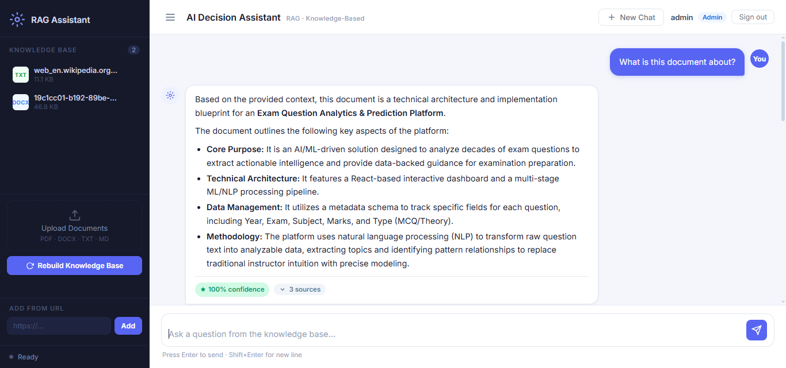
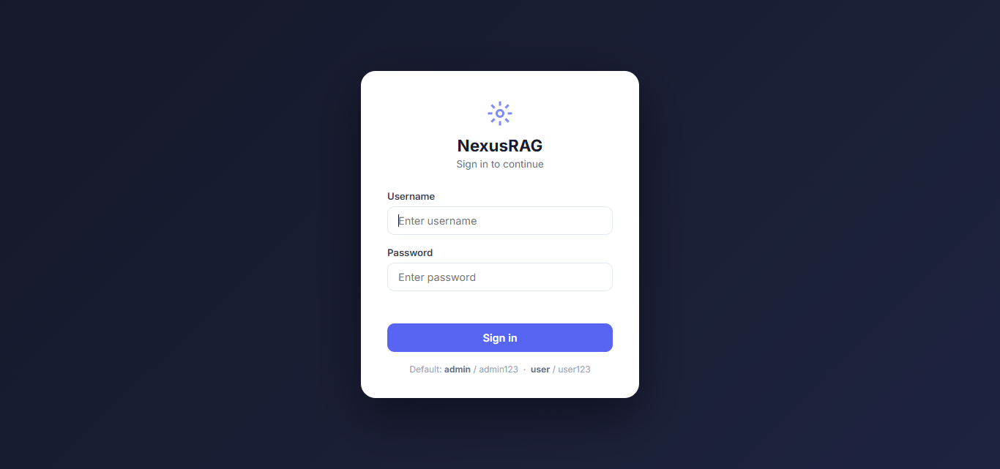
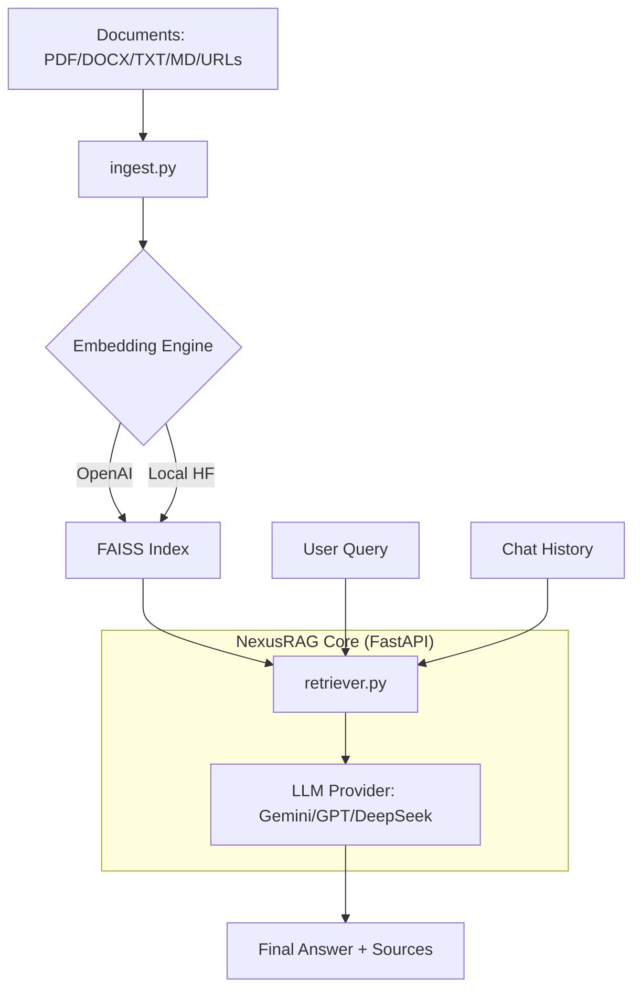
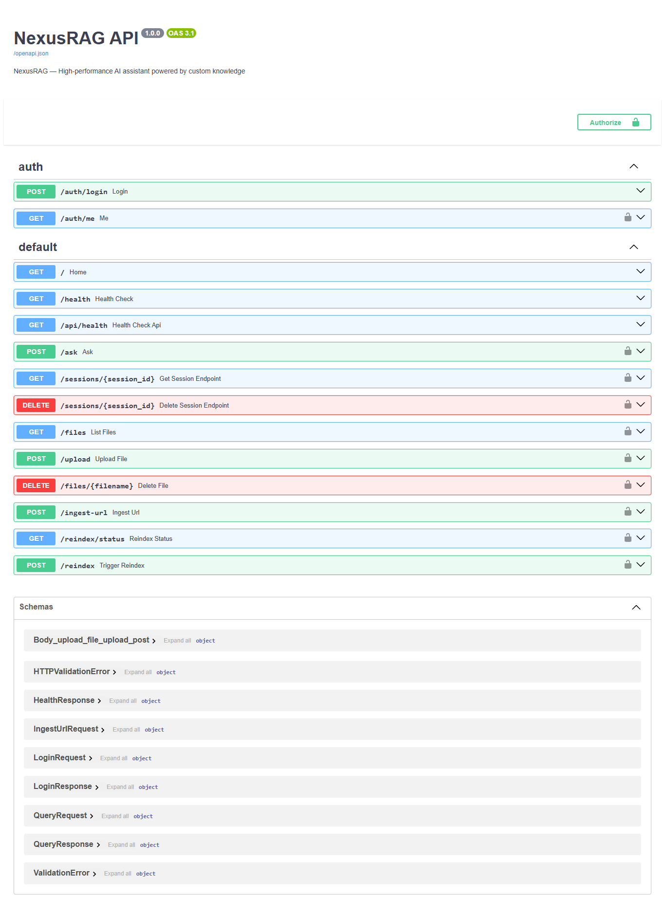

#  NexusRAG
### The Ultimate Privacy-First, Multi-Format RAG Assistant



NexusRAG is a high-performance Retrieval-Augmented Generation (RAG) chatbot designed to answer questions **strictly from your uploaded knowledge base**. It ensures zero hallucinations by grounding every response in provided context.

---

##  Key Features

| Category | capabilities |
|---|---|
| ** Precision RAG** | FAISS-powered vector search, anti-hallucination system prompt, `temperature=0.0`, source citations, and confidence scores. |
| ** Deep Memory** | Context-aware conversations with multi-turn memory management (last 5 turns injected into LLM). |
| ** Multi-Format Support** | Native ingestion of **PDF, DOCX, TXT, MD**, and any public **Web URL**. |
| ** Live KB Manager** | Dynamic knowledge base management: upload, delete, fetch URLs, and rebuild index from the UI — zero downtime. |
| ** Enterprise Security** | JWT-based authentication with RBAC (`admin` vs `user`) and bcrypt-hashed credentials. |
| ** LLM Agnostic** | Seamless switching between **Google Gemini** (default), **OpenAI**, and **DeepSeek**. |
| ** Hybrid Embeddings** | Automatic fallback from OpenAI embeddings to local **HuggingFace** models for offline-first capabilities. |
| **Scalable Storage** | High-speed Redis session management with automatic local in-memory fallback. |

---

##  Interface Preview

### Secure Login


### Intelligent Chat
The interface provides real-time confidence scores, source citations, and a comprehensive sidebar for managing your knowledge base.

---

##  Architecture



---

##  Quick Start

### 1. Installation

```bash
git clone https://github.com/mars01hash/NexusRAG
cd NexusRAG

python -m venv venv
# Windows:
venv\Scripts\activate
# macOS/Linux:
source venv/bin/activate

pip install -r requirements.txt
pip install langchain-google-genai # For Gemini support
```

### 2. Configuration

Run the setup helper:
```bash
python setup_env.py
```

Edit your `.env` file:
```env
PROVIDER=gemini
GEMINI_API_KEY=your_key_here
JWT_SECRET=generate-a-secure-secret
```

### 3. Build Knowledge Base

Drop your files into `knowledge_data/` and run:
```bash
python ingest.py
```

### 4. Launch

```bash
python app.py
```
Visit `http://localhost:8000` to start chatting.

---

##  Docker Deployment

```bash
docker-compose up -d        # Deploy API + Redis
docker-compose logs -f api  # Monitor logs
```

---

##  API Reference



Interactive API documentation is available at:
- **Swagger UI**: [http://localhost:8000/docs](http://localhost:8000/docs)
- **ReDoc**: [http://localhost:8000/redoc](http://localhost:8000/redoc)

### Authentication
- `POST /auth/login` - Authenticate and get JWT
- `GET /auth/me` - Get current user profile

### Chat Operations
- `POST /ask` - Ask a question to the knowledge base
- `GET /sessions/{id}` - Retrieve chat history
- `DELETE /sessions/{id}` - Clear session

### KB Management (Admin)
- `GET /files` - List indexed documents
- `POST /upload` - Upload new document
- `POST /ingest-url` - Scrape web content
- `POST /reindex` - Rebuild vector index

---

##  Configuration Reference

| Variable | Description | Default |
|---|---|---|
| `PROVIDER` | LLM Provider (gemini/openai/deepseek) | `gemini` |
| `GEMINI_MODEL` | Gemini Model Identifier | `gemini-3-flash-preview` |
| `TEMPERATURE` | LLM Temperature (0.0 for precision) | `0.0` |
| `TOP_K_RESULTS` | Number of context chunks retrieved | `3` |
| `INDEX_FILE` | Path to FAISS index | `data/faiss_index.pkl` |
| `REDIS_HOST` | Redis Server Host | `localhost` |

---

##  Security & Privacy

- **No Public Hallucinations**: Responses are strictly bound to the knowledge base.
- **Local Fallback**: Embeddings can run entirely locally if configured.
- **RBAC**: Admin-only access for knowledge base modifications.
- **Secure Sessions**: Redis-backed sessions with auto-expiry.

---

##  Troubleshooting

- **Index Missing**: Ensure you run `python ingest.py` before starting the server.
- **Dependencies**: If using Gemini, ensure `langchain-google-genai` is installed.
- **Redis Issues**: The system will automatically switch to in-memory storage if Redis is unreachable.

---

<div align="center">
Built with ❤️ by [mars01hash](https://github.com/mars01hash)
</div>
